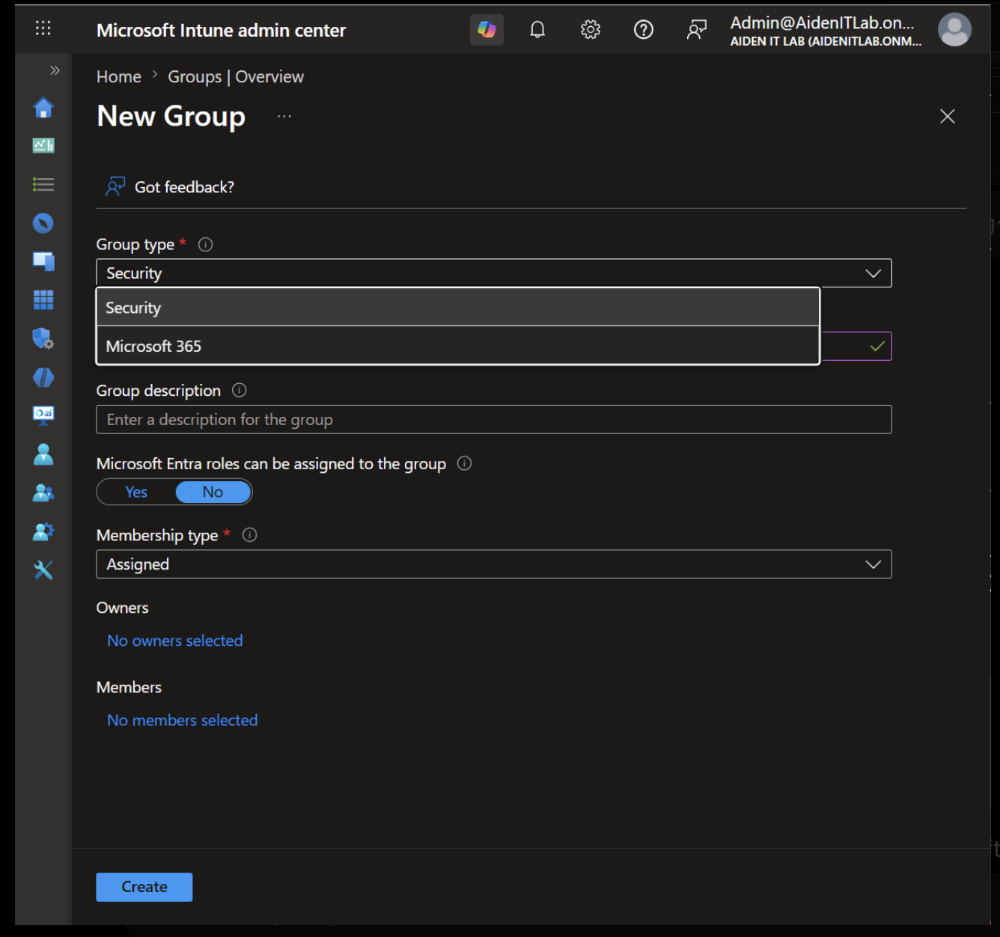
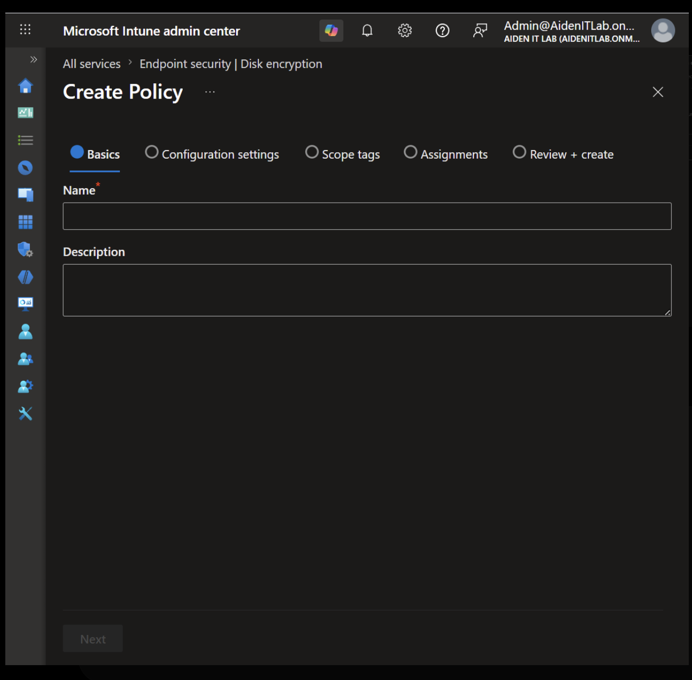
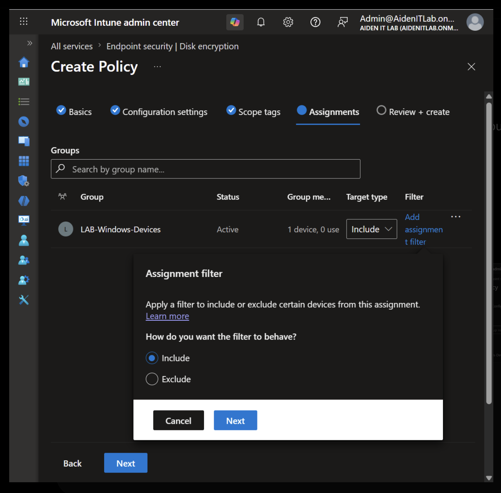
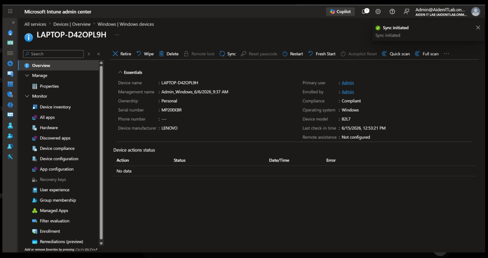
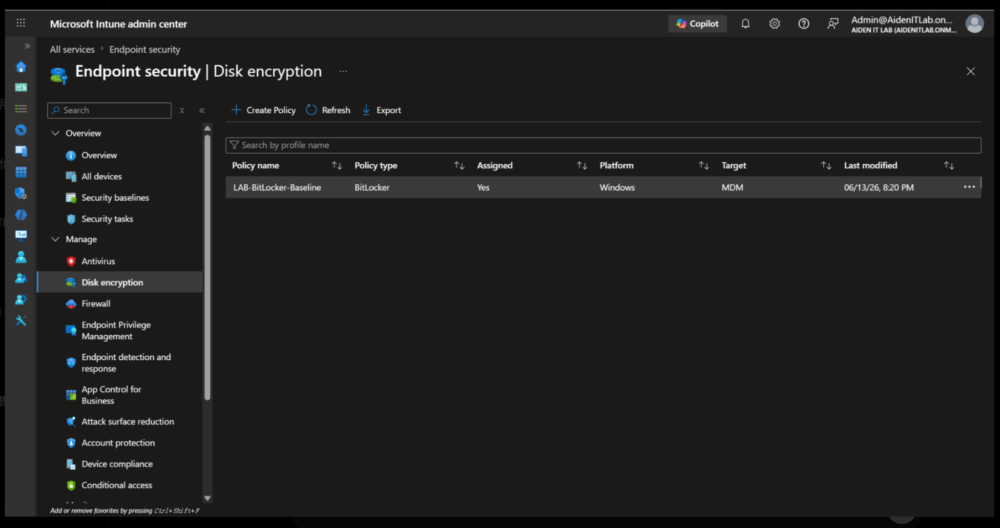
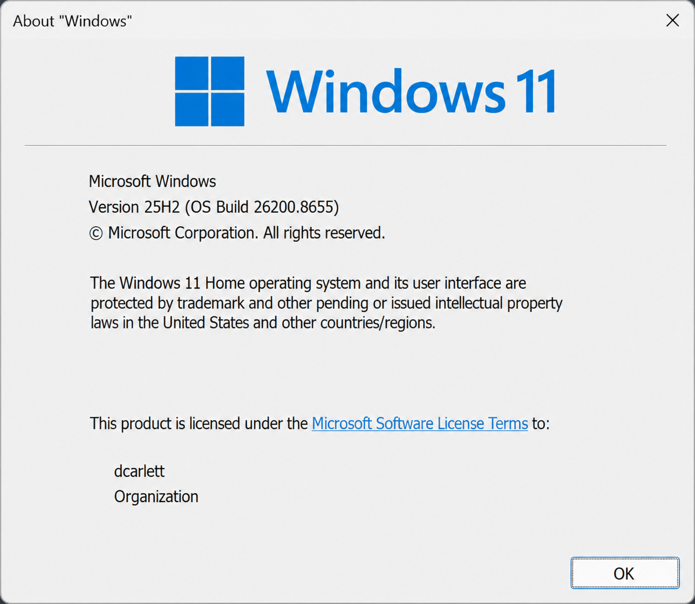

# MD-102 Lab Report: Intune BitLocker Policy Deployment and Troubleshooting

## Background

This lab was completed as part of my preparation for the MD-102 Endpoint Administrator exam. I used a personal Microsoft 365 Business Premium lab tenant to practise endpoint security management with Microsoft Intune.

## Objective

* Create a Security group
* Add a Windows device to the group
* Create a BitLocker disk encryption policy
* Assign the policy to a device group
* Sync the device from Intune
* Check the policy deployment result
* Identify why the policy did not apply successfully

## Lab Environment

| Item                      | Details                                               |
| ------------------------- | ----------------------------------------------------- |
| Tenant type               | Microsoft 365 Business Premium lab tenant             |
| Admin center              | Microsoft Intune admin center                         |
| Device name               | LAPTOP-D42OPL9H                                       |
| Windows edition           | Windows 11 Home Chinese edition                       |
| Windows version           | Windows 11 25H2, OS build 26200.8655                  |
| Device join type          | Microsoft Entra registered / MDM-only enrolled device |
| Enrollment method         | Manual MDM enrollment                                 |
| License                   | Microsoft 365 Business Premium                        |
| Device group              | LAB-Windows-Devices                                   |
| Group type                | Security                                              |
| Membership type           | Assigned                                              |
| Policy name               | LAB-BitLocker-Baseline                                |
| Policy type               | Endpoint security > Disk encryption > BitLocker       |
| Policy platform           | Windows                                               |
| Assignment target         | MDM                                                   |
| Device compliance status  | Compliant                                             |
| Last device check-in time | 6/15/2026, 12:53:21 PM                                |

## Steps

### Step 1: Create a device Security group

I created a new Security group named `LAB-Windows-Devices` in the Microsoft Intune admin center. The group used the `Assigned` membership type, which means devices must be added manually.

Navigation path:

`Intune admin center > Groups > New Group`

In a production environment, this approach allows administrators to target policies to a controlled group of test devices before deploying them to a wider device population.

### Step 2: Add the test Windows device to the group

I added the test laptop `LAPTOP-D42OPL9H` as a device member of the group. The group showed one device and zero users, which confirmed that this was being used as a device-targeted group.

Navigation path:

`Intune admin center > Groups > LAB-Windows-Devices > Members`

Without this step, the BitLocker policy would not have any device target and would not apply to the test laptop.

### Step 3: Create a BitLocker disk encryption policy

I created a new BitLocker policy from the Endpoint security area in Intune. The policy was named `LAB-BitLocker-Baseline`.

Navigation path:

`Intune admin center > Endpoint security > Disk encryption > Create Policy`

This matters because endpoint security policies provide a focused way to manage disk encryption settings for Windows devices.

### Step 4: Configure the BitLocker policy settings

In the Configuration settings page, I configured the BitLocker profile for Windows. The main goal was to test whether Intune could apply a disk encryption requirement to the managed Windows device.

Navigation path:

`Endpoint security > Disk encryption > LAB-BitLocker-Baseline > Configuration settings`

Skipping this step in a real workplace would mean the policy exists, but it would not define the actual encryption behaviour required by the organization.

### Step 5: Assign the policy to the device group

I assigned the BitLocker policy to the `LAB-Windows-Devices` group with the target type set to `Include`. I did not use an assignment filter in this lab.

Navigation path:

`Endpoint security > Disk encryption > LAB-BitLocker-Baseline > Assignments`

Real IT teams use assignment groups because they make policy deployment scalable and reduce the need to configure devices one by one.

### Step 6: Manually sync the device

After the policy was assigned, I opened the device page for `LAPTOP-D42OPL9H` and selected `Sync`. Intune showed a `Sync initiated` message.

Navigation path:

`Intune admin center > Devices > Windows devices > LAPTOP-D42OPL9H > Sync`

This step helps administrators speed up testing because the device can check in sooner instead of waiting for the normal check-in cycle.

### Step 7: Check the policy and device status

I checked the device overview and the disk encryption policy page after syncing the device. The device was shown as managed by Intune and compliant, and the policy `LAB-BitLocker-Baseline` was listed under Disk encryption with assignment enabled.

Navigation path:

`Devices > Windows devices > LAPTOP-D42OPL9H > Overview`

`Endpoint security > Disk encryption`

This matters because administrators must verify the result after deployment instead of assuming that a created policy has applied successfully.

## Troubleshooting Result

The expected result was that the BitLocker policy would apply to the Windows device and enable disk encryption management through Intune.

The actual result was that the policy did not apply successfully and was treated as not applicable to the test device. The root cause was the Windows edition. The test laptop was running Windows 11 Home, which is not suitable for this enterprise BitLocker management scenario in Intune.

The group assignment was not the cause. The policy was created, assigned to the correct group, and the device was included in that group. The sync action was also initiated successfully. The issue was related to the operating system edition, not the policy assignment workflow.

## Summary

In this lab, I created a Security group, added a Windows test device, created a BitLocker disk encryption policy, assigned it to the device group, and manually synced the device. The policy deployment workflow was completed successfully from an Intune administration perspective. However, the policy did not apply due to an OS edition limitation. This lab gave me practical experience with Intune policy assignment, device targeting, sync, and troubleshooting.

