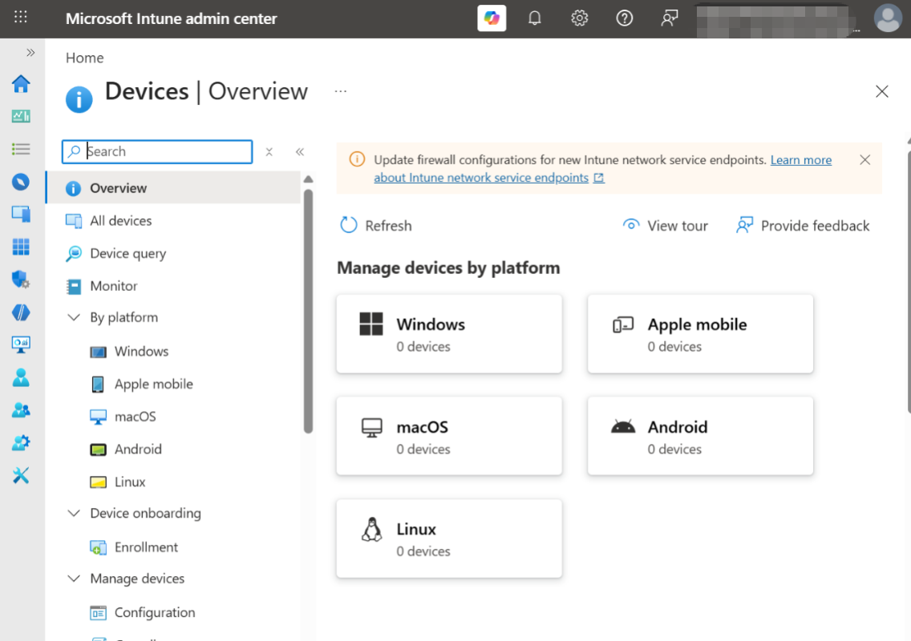
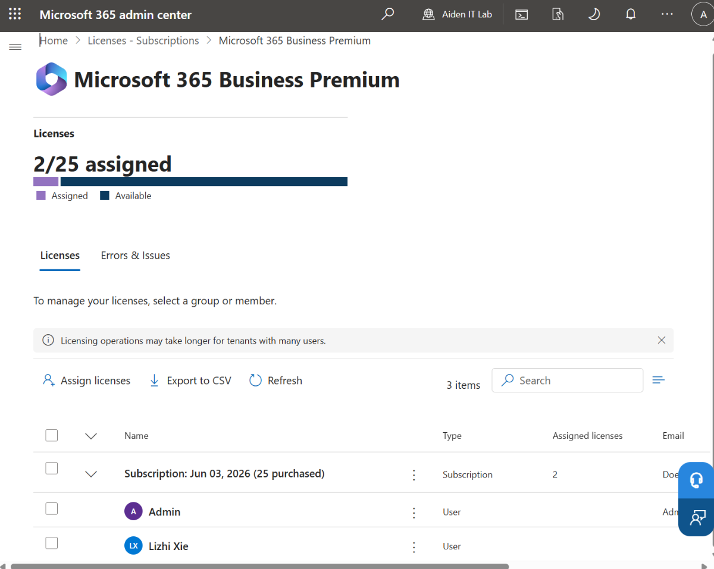
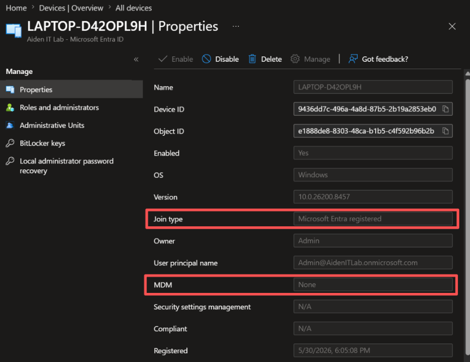
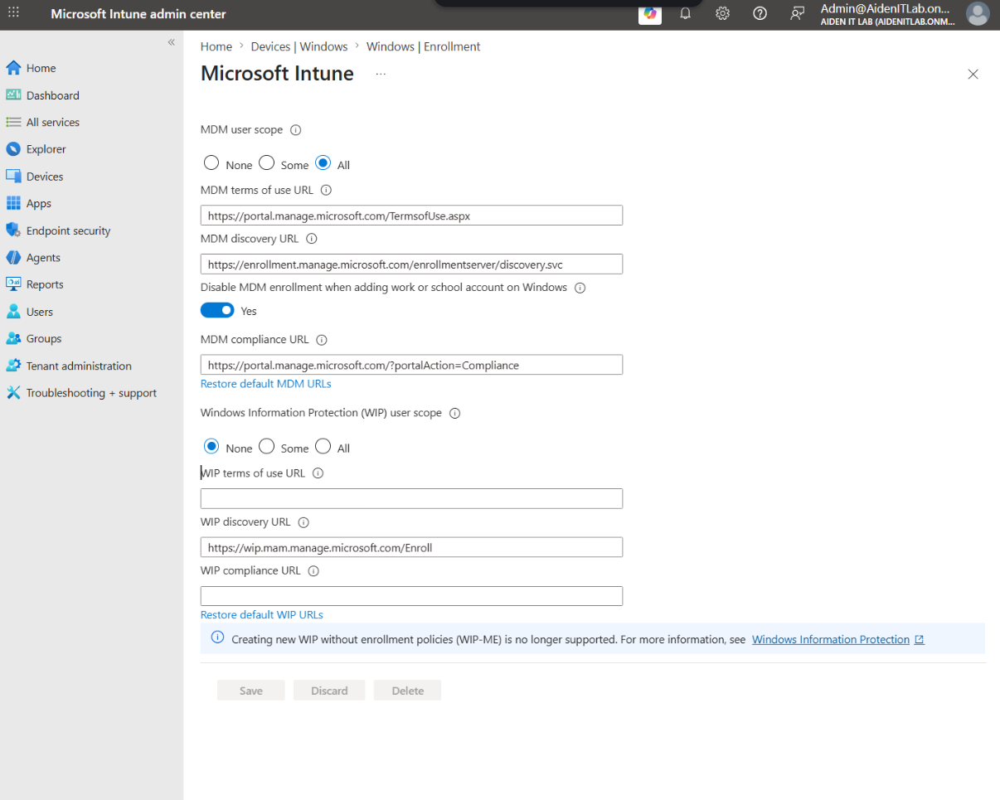
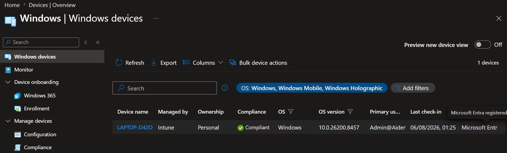

## Objective

The goal of this lab was to enrol a Windows 10 device into Microsoft Intune and associate it with the correct user.

## Environment

- Windows 10
- Microsoft Entra ID
- Microsoft Intune
- Microsoft 365 Business Premium

## Problem

The device appeared in Microsoft Entra ID, but it was not displayed correctly in Microsoft Intune.



## Investigation

Steps I checked:

### Step 1: Verify the Microsoft 365 licence

The user had an active Microsoft 365 Business Premium licence,
which includes Microsoft Intune. Therefore, licensing was not the
cause of the issue.



### Step 2: Check the device in Microsoft Entra ID

The device existed in Microsoft Entra ID, but its join type was
`Microsoft Entra registered` and its MDM status was `None`.
This confirmed that Entra registration had succeeded, but Intune
enrolment had not.


### Step 3: Check the MDM user scope

The MDM user scope was configured as `All`, so the affected user
was eligible for automatic Intune enrolment.



### Step 4: Run dsregcmd /status

The command returned:

- AzureAdJoined: NO
- WorkplaceJoined: YES

This showed that the device was workplace registered rather than
Microsoft Entra joined.

```text
AzureAdJoined : NO
EnterpriseJoined : NO
WorkplaceJoined : YES

WorkplaceSettingsUrl :
```
## Root Cause

The device was Microsoft Entra registered, but it had not completed
Microsoft Intune MDM enrolment. The device status showed `MDM: None`,
and `dsregcmd /status` showed `AzureAdJoined: NO` and
`WorkplaceJoined: YES`.

The work or school account connection needed to be re-established
after confirming that the user had a valid Intune licence and was
included in the MDM user scope.


## Resolution

After checking the enrolment settings and reconnecting the work account, the device successfully appeared in Microsoft Intune.



## Verification

The device was visible in both Microsoft Entra ID and Microsoft Intune.

## Troubleshooting Workflow

```text
Check Device State
  -> Check License
  -> Check MDM User Scope
  -> Run dsregcmd /status
  -> Verify MDM Discovery
  -> Perform Enrollment
  -> Verify Intune Management State
```
